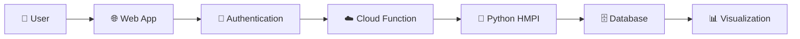

<div align="center">
  
# 💧 Jal Shakti: Groundwater Quality Calculator

[](https://nextjs.org/)
[](https://www.typescriptlang.org/)
[](https://web.dev/progressive-web-apps/)
[](https://firebase.google.com/)
[](https://cloud.google.com/)
[](#)

</div>

<div align="center">
  
</div>

<div align="center">
  
**🌊 A cutting-edge web application for calculating Heavy Metal Pollution Index (HMPI) in groundwater quality assessment**

*Empowering environmental professionals, researchers, and students with intelligent automation tools*

</div>

---
## ✨ Key Features

### 🔧 **Data Input & Processing**
- **📝 Manual Input**: Direct entry of heavy metal concentration values
- **📊 Automated Upload**: AI-powered analysis of lab report images
- **🤖 OCR Technology**: Genkit AI flow automatically extracts data from reports

### 🌍 **Location & Analysis**
- **📍 Geolocation**: Automatic GPS coordinate capture for sample location tagging
- **⚡ HMPI Calculation**: Instant Heavy Metal Pollution Index computation
- **🎯 Quality Assessment**: Water quality categorization (Low, Medium, High, Very High)

### 📈 **Visualization & Reporting**
- **📊 Interactive Charts**: HMPI trend visualization over time
- **📋 Report Generation**: Export assessments in PDF and CSV formats
- **📚 History Tracking**: Comprehensive past assessment records
- **🗺️ Pollution Mapping**: Visual contamination hotspot identification

### ⚙️ **Customization**
- **🔢 Unit Configuration**: Flexible measurement unit settings
- **🌓 Theme Toggle**: Light and dark mode support
- **👤 User Management**: Secure authentication system

### 📱 **Progressive Web App (PWA) Features**
- **🚀 Native-like Experience**: Install directly from browser without app stores
- **📵 Offline Functionality**: Work seamlessly without internet connectivity
- **💾 Minimal Storage**: ~2MB installation vs traditional 50MB+ native apps
- **⚡ Lightning Fast**: Instant loading with service worker caching
- **🔄 Auto Updates**: Background updates without user intervention
- **📱 Cross-Platform**: Single codebase works on iOS, Android, and Desktop
- **🔋 Battery Efficient**: Optimized performance for low-end devices
- **📶 Low Data Usage**: Progressive loading and smart caching strategies

## 🏗️ Technical Architecture

### 🛠️ **Technology Stack**

<div align="center">

| Technology | Purpose | Icon |
|------------|---------|------|
| **🔥 Firebase Hosting** | Fast, secure web hosting |  |
| **⚡ Google Cloud Functions** | Serverless computation |  |
| **🗄️ Google Cloud SQL** | PostgreSQL with PostGIS |  |
| **🔐 Firebase Authentication** | Secure user management |  |
| **🗺️ Leaflet.js / Mapbox** | Interactive mapping |  |
| **📱 PWA Technologies** | Native-like mobile experience |  |
| **🔄 Service Workers** | Offline functionality & caching |  |

</div>

### 🔄 **Implementation Workflow**

<div align="center">
  
</div>

<div align="center">



</div>

#### 📋 **Process Flow**

1. **🚀 User Interaction**: Access web application via Firebase Hosting
2. **🔑 Authentication**: Secure login/signup with Firebase Auth
3. **📡 API Request**: Frontend sends data to Cloud Function endpoint
4. **⚙️ Core Calculation**: Python-based HMPI computation in the cloud
5. **💾 Database Operations**: Store results and retrieve historical data
6. **📈 Response & Visualization**: Display results with interactive maps

---

## 📱 Progressive Web App Excellence

<div align="center">

### 🌟 **Why PWA? Native Mobile Experience Without the Hassle**

</div>

<table align="center">
<tr>
<th>📱 Traditional Native Apps</th>
<th>🌐 Our PWA Solution</th>
</tr>
<tr>
<td>

❌ **50MB+ Download Size**<br/>
❌ **App Store Approval Delays**<br/>
❌ **Platform-specific Development**<br/>
❌ **Requires High-end Devices**<br/>
❌ **Manual Update Process**<br/>

</td>
<td>

✅ **~2MB Lightweight Installation**<br/>
✅ **Instant Access via Browser**<br/>
✅ **Single Codebase for All Platforms**<br/>
✅ **Optimized for Low-end Devices**<br/>
✅ **Automatic Background Updates**<br/>

</td>
</tr>
</table>

### 🔧 **Technical PWA Implementation**

<div align="center">

| Feature | Implementation | Benefit |
|---------|---------------|---------|
| **📦 Service Worker** | Custom caching strategies | Offline functionality + faster loading |
| **📱 Web App Manifest** | Native installation prompts | Home screen installation |
| **💾 IndexedDB Storage** | Local data persistence | Work without internet |
| **🔄 Background Sync** | Queue actions when offline | Seamless data synchronization |
| **📲 Push Notifications** | Real-time pollution alerts | Immediate hazard warnings |
| **⚡ Lazy Loading** | Progressive resource loading | Optimal performance on 2G networks |

</div>

### 🌍 **Universal Device Compatibility**
- **💻 Laptops**: Full-featured desktop experience with all capabilities
- **📱 Mobile Phones**: Optimized touch interface for field data collection
- **📟 Tablets**: Perfect balance of screen size and portability for research
- **⌚ Smart Watches**: Basic data viewing and quick pollution alerts
- **🖥️ Desktop Computers**: Complete analysis and report generation
- **📺 Smart TVs**: Data visualization for presentations and monitoring
- **🏞️ Remote Locations**: Functions in areas with poor connectivity
- **🔋 Battery Optimization**: Minimal power consumption for extended fieldwork  
- ** Cost Effective**: No need for expensive hardware upgrades
- **🌐 Universal Access**: Works on **ANY device with a modern browser**

---

## 🚀 Getting Started

### 📋 **Prerequisites**
- 📦 Node.js (v18 or higher)
- 🧶 npm or yarn package manager
- 🔥 Firebase CLI (optional, for deployment)

### ⚡ **Quick Setup**

#### 1️⃣ **Install Dependencies**
```bash
# 📥 Install all required packages
npm install
```

#### 2️⃣ **Start Development Server**
```bash
# 🏃‍♂️ Run the Next.js development server
npm run dev
```
🌐 **Access the application at:** [http://localhost:9002](http://localhost:9002)

#### 3️⃣ **AI Flows Setup** *(Optional)*
```bash
# 🤖 Start Genkit AI development server
npm run genkit:dev
```
🔧 **Genkit UI available at:** [http://localhost:4000](http://localhost:4000)

### 🔧 **Available Scripts**

| Command | Description | Icon |
|---------|-------------|------|
| `npm run dev` | Start development server | 🏃‍♂️ |
| `npm run build` | Build for production | 🏗️ |
| `npm run start` | Start production server | 🚀 |
| `npm run genkit:dev` | Start AI flows UI | 🤖 |
| `npm run lint` | Code linting | 🔍 |

## 📁 Project Structure

```
📦 Jal-Shakti-App/
├── 🌐 src/app/              # Next.js App Router pages
│   ├── 🏠 page.tsx          # Home dashboard
│   ├── 📊 report/           # Report generation
│   ├── 📈 results/          # HMPI results display
│   ├── 📚 history/          # Past assessments
│   └── ⚙️ settings/         # User preferences
├── 🧩 src/components/       # Reusable React components
│   ├── 📊 dashboard/        # Main dashboard components
│   ├── 🗺️ maps/            # Mapping components
│   ├── 📋 forms/            # Input forms
│   └── 🎨 ui/              # UI primitives
├── 🤖 src/ai/flows/         # Genkit AI workflows
│   ├── 📖 extract-hmpi-from-report.ts
│   ├── 🗺️ generate-pollution-map.ts
│   └── 💡 suggest-remediation.ts
├── 🛠️ src/lib/             # Utilities & helpers
├── 🎯 public/              # Static assets
└── 📄 docs/                # Documentation
```

### 🎯 **Core Directories**

| Directory | Purpose | Key Files |
|-----------|---------|-----------|
| **📱 `src/app/`** | Application pages | Layout, routing, page components |
| **🧩 `src/components/`** | UI components | Dashboard, forms, charts, maps |
| **🤖 `src/ai/`** | AI workflows | OCR, data extraction, recommendations |
| **🛠️ `src/lib/`** | Utilities | Data processing, API helpers |

---

## 📱 Application Screenshots

<div align="center">
  
### 🏠 **Dashboard Views**

<table>
  <tr>
    <td align="center">
      
      <br/>
      <strong>🏠 Home Dashboard</strong>
    </td>
    <td align="center">
      
      <br/>
      <strong>📊 Data Input</strong>
    </td>
    <td align="center">
      
      <br/>
      <strong>📈 Results Analysis</strong>
    </td>
  </tr>
  <tr>
    <td align="center">
      
      <br/>
      <strong>📋 Report Generation</strong>
    </td>
    <td align="center">
      
      <br/>
      <strong>🚨 Pollution Alerts</strong>
    </td>
    <td align="center">
      
      <br/>
      <strong>📚 Historical Data</strong>
    </td>
  </tr>
</table>

</div>

---

<div align="center">

### 🌟 **Star this repository if you find it helpful!**

[](https://github.com/shaikhakramshakil/Jal-Shakti-App/stargazers)
[](https://github.com/shaikhakramshakil/Jal-Shakti-App/network)

**Made with 💙 for clean water initiatives**

</div>
